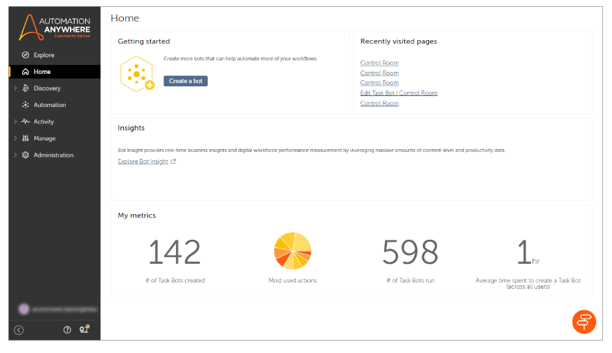

**Bot Developer(Automation 360) course**

## Introduction
- Automation Anywhere is AI-powered flagship platform by Automation Anywhere.
- It is the world's only cloud-native, web-based platform for end to end automation that enables you to automate process with low infrastructure cost and fater calling.
- Automation anywhere combines:
   - Consumer like usability
   - Enterprise-class reliability
   - Security for intelligent automation
   - Automate on their own in real time.

## Core components of Auotmation Anywhere-
- Pathfinder:- The automation anywhere pathfinder program is designed to assist organizations on their automation journey. It offers valuable guidance on kick-starting your digital workforce, accelerating and enhancing business impact and scaling automation throughout the enterptise.
- Process Discovery :- This tool enables organizations to discover the fastest path to process optimizations and business ROI(return on investment) by eliminating the need for manual methods of discovering business process and tasks that need to be automated.
- Document Automation:- It provides intelligent data extraction capabilities, enabling information processing from semi-structured documents such as invoices, utility bills, and receipts. Integration of the products with solutions such as Google Doc API pre-trainded models allows efficient data extraction based on ML and AI
- RPA and API
- Integrate:- Easily integrate automation-powered user experiences by creating them in Auotomation CO-Pilot interface and embedding them directly into your applications.
- Measure:- Measurement of the value generated by the deployed automation is simplified with CoE  Manager Application.

## Roles in Automation Anywhere
- Citizen Developer:- 
     - Citizen Developers are members of a business unit within an organization and know their department’s business processes, operations, and insights.
     - They have acquired skills with low-code or no-code automation tools to address specific business problems and may spend part of their time automating processes for their business unit.
- Pro Developer:- 
     - Pro Developers are technical team members who are responsible for the design, development, and implementation of automation to enhance business process efficiency.
     - They may also review the work of Citizen Developers, providing guidance to ensure that automated processes are resilient, maintainable, and secure.
     - They have a background in computer software development and are familiar with development tools, processes, and best practices.
- IT Manager:- 
     - IT Managers are responsible for the management and maintenance of their organization's information technology systems, networks, and equipment.
     - Specific to automation, they ensure that users and devices are provisioned with secure systems' access, and applications required to deploy and run automation.

## The key steps to Automate the Process:-
- Create a process blueprint.
- Building a bot. 
- Running the bot.

## Steps to create a Process Blueprint:-
- Login to Automation 360 Control room
- Register your device
     -  Download and install the Bot Agent
     -  Register your device
     - Update the credentials
- Create a task bot
     - Extract the data from a web portal into a CSV file
     - Open the CSV file and launch a CRM(Customer Relationship Manahement) website
     - Populate the CRM webform
     - Save and send the CSV file to the relationship manager.
- Run the bot to automate the data collection.  
- Note: The device registration and bot development process for Community Edition and Enterprise Edition are the same.

## RPA Workspace:-

- From here, you can access all the tools necessary for administering, creating, modifying or updating, and deploying automated processes.
- Automation 360 uses Role- Based Access Control(RBAC) to allow users access to bots and to various features.
- If you are logged in as administrator then you will be able to see the collective metrics for all the registered users.

## How to register your device
To register the device, first download the Bot Agent. Register your device after selecting the appropriate settings and updating your device credentials. A device is a machine used for running the bots. You will also be installing the Automation Anywhere Bot Agent, a lightweight software that will run on your device, as part of this process. Once registered, devices can directly communicate with the Control Room without any user intervention.
## Control room:- 
The Control Room is a centralized point that allows you to manage, schedule, execute, and configure various capabilities of bots and Bot Runner machines.
## Automation Anywhere Bot Agent:- 
- Automation Anywhere Bot Agent, a lightweight software that will run on your device, as part of this process. 
- The Bot Agent installs Manifest V3 extensions for Google Chrome and Microsoft Edge browsers when you install Automation.