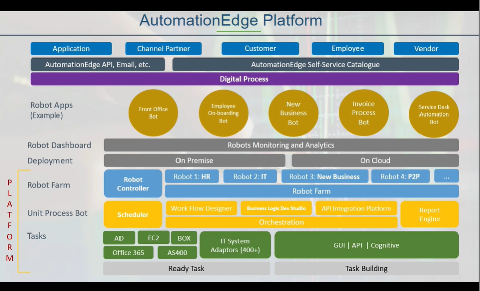

**Automation Edge Introduction**

## What is Automation?
Ability to perform specific tasks automatically without the need for constant human supervision or intervention.
## Robotic Process Automation is-
- A straightforward tool to automate manual, repetitive tasks.
- Set of rules that solves specific problems.
- Software "bots" and plugin into and access existing business system.
- Workflow enabled interaction.
## Robotic Process Automation is not-
- A human robot
- Some tool that can replace human entirely.
- Purely used for cost cutting.
- Something that replicates human cognitive functions yet.
## Future of automation lies in Industry Specific ready solutions(SOLFLO):- 
- SOLFLO are ready to use automation solutions that are essential for Banking, Insurance and healthcare industry.
- SOLFLO are ready to use automation solutions.
## Automation Edge Capabilities
- RPA:- Executes after classifying and categorizing the input data.
- DocEdge:- Reads data from diverse sources like image, pdf.
- CogniBot:- Understands the intent/context of the content.
## Conversational IT :-
-  It is a single pane window for personalize IT support.
- Meet your employees in the channel of their choice
- Your chat channel now becomes your service desk   
## RPA vs ITPA
- ITPA is mostly focused on automating IT process including task such as system monitoring. while RPA is mostly focus on routine, repetitive and manual process such as data processing and customer service enquiry.RPA eg.Front-end Screen Automation and ITPA eg. Ready Bot Automation
## Advantages of AutomationEdge:
- Boosts capability
- Reduce costs
- Increase customer satisfaction
- Ensures higher accuracy and reliability
- Enhances productivity

## AutomationEdge HyperAutomation PLatform and Solution wheels:- 

- Communication Mining:- It is initial automation step. It involes analysis of extensive data such as email, chat,ERP, CRM. By engaging in communication mining organizations can idnetify process that are suitable for automation. Communication mining gives potential of data.

- Input AI:- Input AI is second step. It helps us to get useful data outof unstructured and semistructured data.Input is nothing but intelligent document processing. Also contains conversational AI which gives meanings outof conversation. Input AI will help you get the meaningful information from the data.

- Automation:- Its third step.
- Integration:- This is fourth step. It deals with data integration or API integration. In Automation edge it contains connectors. This connectors can connect to the third party application via API. Automation edge provides the feature called ETL(Extract Transform and Load) which enables processing of large volume of data.
- Analytics:- This is fifth step .Use to build the reports and dasahboards.

- Solution Flows:- It's last step. It is readily available solutions.

## Major components of Automation Edge
- Automation Edge Process Studio:- use for development
- Automation Edge Server:- use for deployment of process developed
- Automation Edge Agent:- workflows are carried out on agent machine.

## AutomationEdge Architecture

## AutomationEdge Platform:-
- At the bottom layer we have task. Tasks readily available components known as plugins. This plugins provides means to establish communication over different system.
- Unit process Bot:- After obtaining tasks next steps is to assemble them into coherent flow as there will be sequence of automation to be executed. Uses process studio as a tool.
- Robot Farm:- This contains multiple robots. Which supports automation edge. These robots are also called as Agents and are responsible for executing automatic process. It helps us to assign the robots for different process.
- Deploment:- It contains two deployment options 'On Premise' and 'Cloud'. In 'On premise' AutomationEdge is install on local machines within the organizations infrastructure. 'On Cloud' here AutomationEdge server is deployed on cloud.
- Robot Dashboard:- Use for Robot monitoring and analytics.
- AutomationEdge Self-Service Catalogue:- It acts as platform to submitting request to execute workflows.
